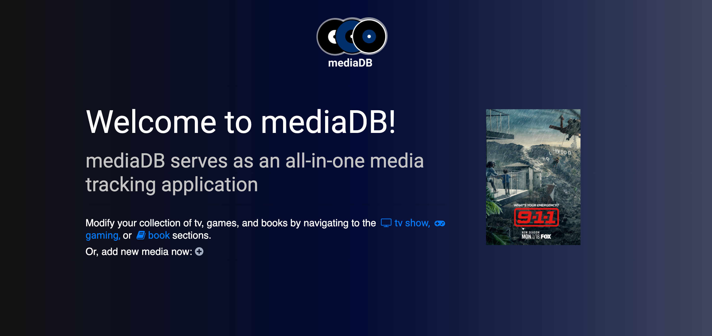

# mediaDB
### Media library front end application using Bootstrap components, NodeJS, and Express
 

# Deployed on Heroku
### https://nucamp-media-db.herokuapp.com/ 

 

# Designed using Figma
## Screenshots
### X-Large Viewport

### X-Large Viewport - Gaming Page

### iPhone

### Pixel - Gaming Page

## Logo

 

## Credits
- [Deploy your front-end app](https://medium.com/jondengdevelops/deploy-your-front-end-app-in-20-lines-of-code-24be44f8b51) by Jon Deng
